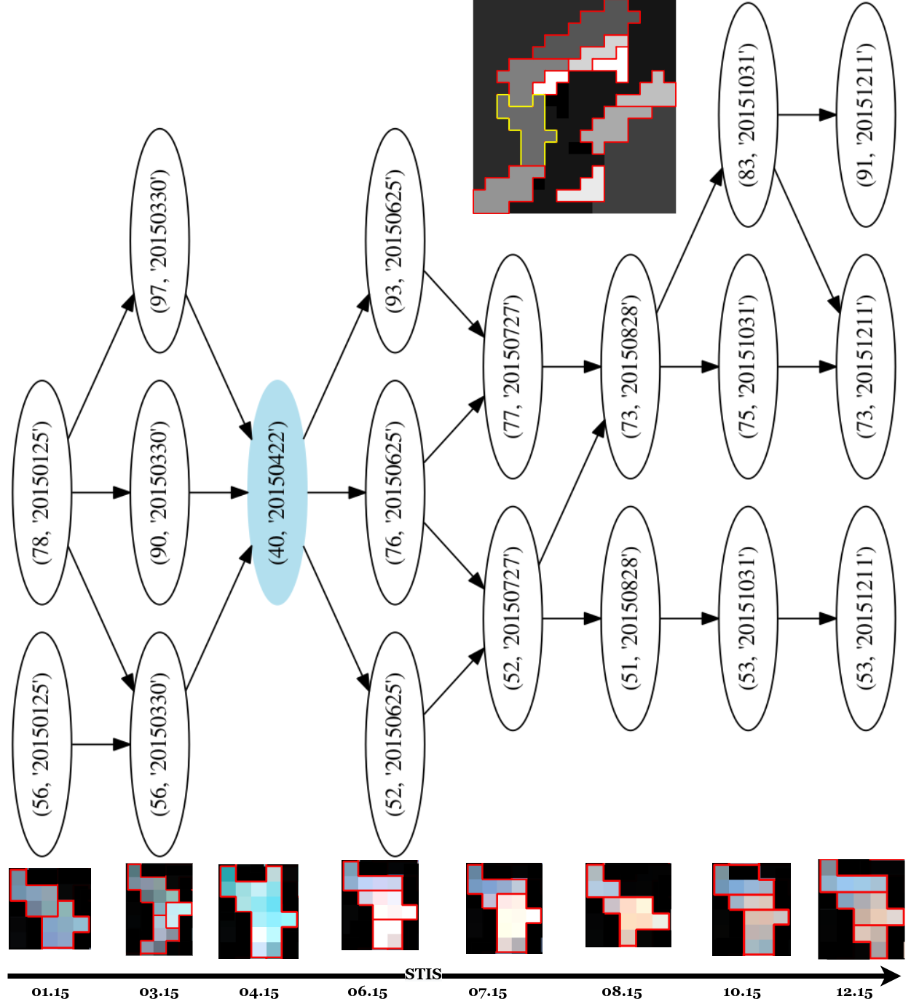

### GrapheBuilder4STIS

Cette approche proposée par : 

* Fabio Guttler, Dino Ienco, Jordi Nin, Maguelonne Teisseire, and Pascal Poncelet. A
graph-based approach to detect spatiotemporal dynamics in satellite image time series.
ISPRS Journal of Photogrammetry and Remote Sensing, 130 :92–107, 2017.

et reprise par 

 * Lynda Khiali, Dino Ienco, and Maguelonne Teisseire. Object-oriented satellite image
time series analysis using a graph-based representation. Ecological Informatics, 43 :
52–64, 2018. ISSN 1574-9541. doi : https://doi.org/10.1016/j.ecoinf.2017.11.003. URL
https://www.sciencedirect.com/science/article/pii/S1574954117301851.

 * https://repository.vnu.edu.vn/flowpaper/simple_document.php?subfolder=99/52/15/&doc=99521570707689596285171859793420133872&bitsid=0756f7c2-4204-4440-8679-8d24aa60ca16&uid= 

peut-être résumée comme suite :

 * Motivation : toute entité spatiale pouvant être identifiée sur une
image satellite peut-être suivie dans le temps et dans l’espace

 * Principe : Représenter sous forme de graphe d’évolution, l’évolution
de l’entité spatiale dans le temps

 * Entrée : Une STIS segmentées
  
 * Sortie : Un objet (segment/entité) est réprésenté sous forme de graphe d'évolution.
 
   * Une entité spatialement stable entre deux dates différentes, sera représentée par un noeud, tandis qu’une entité qui subit des
modifications (ex : division) sera représentée par au moins deux noeuds

### Exemple de graphe d'évolution

